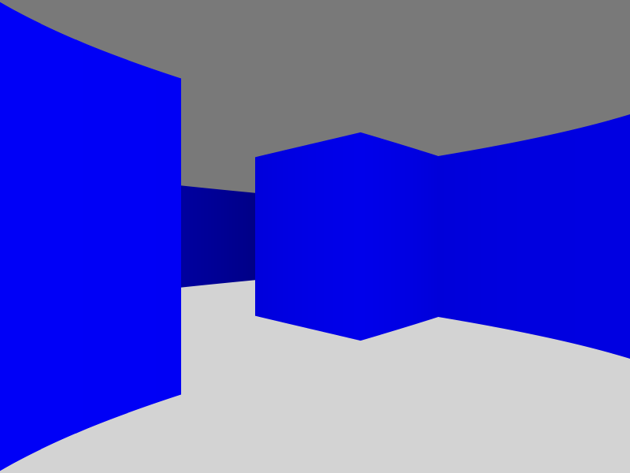

# A raycaster in typescript

```
$ npm install
$ gulp
$ python -m http.serve -d dist/
```

You can move with W/A/S/D or the equivalent for your keymap (Z/Q/S/D for azerty).



A demo is available [here](https://raycaster.slaanesh.org/).